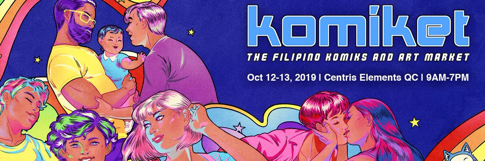
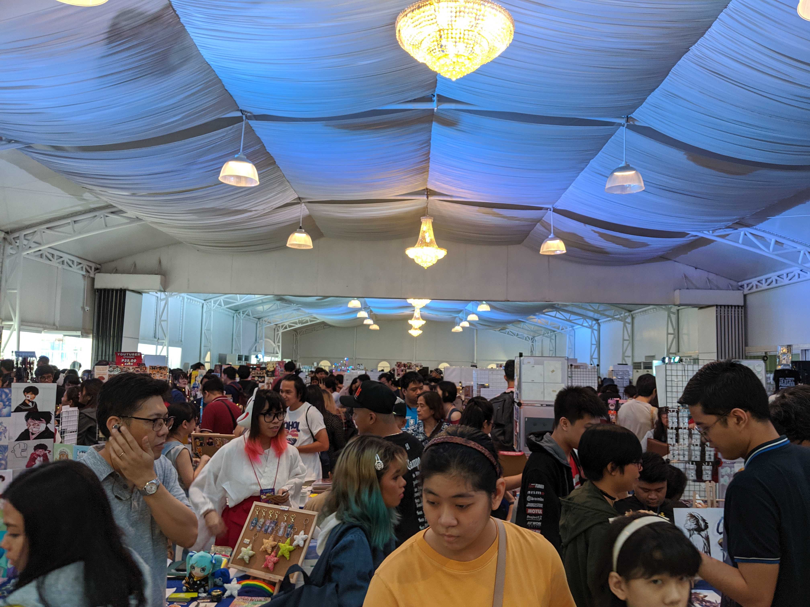

<html>
<head>
<title>Seening | Main Page</title>

<header>

</img>
 A look into the Filipino art scene

<ul>
  <li><a class="active" href="#home">Home</a></li>
  <li><a href="#articles">Articles</a></li>
  <li><a href="#about">About</a></li>
</ul>
</header>
	
</head>

<body>

	

<h1>Almost 600 artists attend Komiket art convention</h1>

Written by Berns Rabaja Oct 17, Thursday

</img>

Photo from  <a href="https://twitter.com/komiketph"> Komiket Twitter page </a> 

	
 Over 580 comic and fanart creators mingle with fans and enthusiasts in the <a href="https://web.facebook.com/komiketph/">Komiket Comic Art Market</a> held at Centris Elements in Quezon City last weekend. 
 

 Interested artists may apply for a booth, pay the rent of Php 6,000.00 per table, 
	and bring their merchandise to the venue. The six thousand peso rent may also be shared by a maximum of three artists, which could bring the rent down to a minimum of Php 2,000.00 per person for the whole two days. Most of the exhibitors were online creators who make webcomics or fanart, but also include traditional comics creators and other, more niche creators like sculptors or jewelry-makers. 

	
On the other hand, fans may enter the venue by buying a ticket for Php 100.00, which is usable for both days.

	

	

</img>

 Komiket is one of the many art conventions in the Philippines, although it is one of the first to introduce conventions that last for more than one day. Photo by Christian Venus

Having over half a thousand artists with their own fans and visitors, however, meant that the place was cramped. The small space in between the rows of tables were hard to navigate, especially when near the tables of the more popular artists, as that meant there were more people flocked around the tables.
	Fortunately, the entire venue is air-conditioned.

	

 Despite the lack of space, Apolonio “Pol” Medina said he likes frequenting conventions like Komiket. The <a href="https://web.facebook.com/PugadBaboyPh/">Pugad Baboy</a> creator finds the rent relatively low, and he said he has more freedom in the choice of merchandise. Already with his 31st book (also marking his 31st year in the industry), Medina shared his gripe with mainstream publishers.
	 

	
	

 “Baka hindi payagan na ilabas yung comics ko ngayon, kasi may pagka-off beat eh: may kaunting nudity, may profanity,” he explained. “Pag nilabas ko yan sa mga mainstream na bookstores, baka hindi payagan.”
	 

 
	
</img>

Pol Medina sells his Pugad Baboy volumes at Php 100-150. He also shares his plans of selling t-shirts and tumblers, ideas he got from his fellow exhibitors. Photo by Christian Venus

	

 
He also lamented that mainstream publishers and bookstores often take a large percentage of his revenue, as compared to what he earns at a convention.
	 

 “Ito na ang bread and butter ko, maliban sa mga dyaryo,” he said. “Mas madalas na talaga ako sa cons, o kaya sa mga comic stores.”
	 

 While Komiket houses notable names like Pol Medina, Manix Abrera of “Kikomachine Komiks”, and Lyndon Gregorio of “Beerkada”, the convention also welcomes up-and-coming artists. In fact, one of their youngest artists, and the youngest for this particular convention, is only eleven years old.
	 

   

</img>

Piper, Komikon 2019' youngest exhibitor, enjoys selling his stickers at Komiket, but also wants to someday be able to join other cons like Komikon or Stickercon. Photos (left to right) by Berns Rabaja and Christian Venus

	

	Philippe, also known as <a href="https://www.instagram.com/artbypiper/">Art by Piper</a> or simply Piper, makes fanart of TV shows he likes, like Adventure Time, and sells stickers and prints of them. It’s his fifth Komiket in three years, having attended the South Komikets in Makati City as well. He’s assisted by his aunt, Kat Pineda, who shares that at first, Piper was just “salingkitkit”, or not really registered and just participating on a whim.
	 

 “Yung unang beses, para talaga sa mom niya, sa booth ng Manila Art Post,” she said. “Nagkataon na hindi nakarating yung nasa katabing table, so pinagamit sa amin yung table na yun. Salingkitkit lang, kapag napagod, tigil na. Hanggang sa nagtuloy-tuloy.”
	 

 Piper also enjoys walking around the convention and buying stuff for himself. He shared one of his favorite moments, when a cosplayer—which is not an uncommon sight in conventions—he calls Spiderdad started dancing to the song Sunshine. He wishes for more children to go to cons and experience these things, whether as fans or as creators.
	 

 Pol Medina shares similar sentiments, but for Filipinos of all ages. He believes that Komiket helps “close comic book enthusiasts” find their crowd.

 

 "Akala nila nagiisa sila. Hindi nila alam na marami rin palang gusto. Hindi nila alam kung saan pupunta eh,” Medina said. “[Pero kung] buwan-buwan may ganitong event, may mapupuntahan [sila].”
 

	

	

	
	
	
<h1>2010s: A Comic "Renaissance"</h1>

Written by Berns Rabaja Nov 14, Thursday

	Lead: #Hunghangsona trending
	
	Nutgraf: 2nd Interview with Pol Medina
	STATEMENT: "Social media helped usher in a sort of 'renaissance' in Pinoy Komiks"
	
	Body:
	What is a renaissance
	PH Komiks History by Alice Guillermo
	Interview with Ymelda Paiban (pinoy animators)
	Interview with Pol medina
	Who is Hunghang Flashbacks
	Loser Mangaka game

	Conclusion: Is there a comic renaissance?

	
	
	
	
	
	

	

Background Photo by Lucas Lenzi on Unsplash

</body>
</html>
