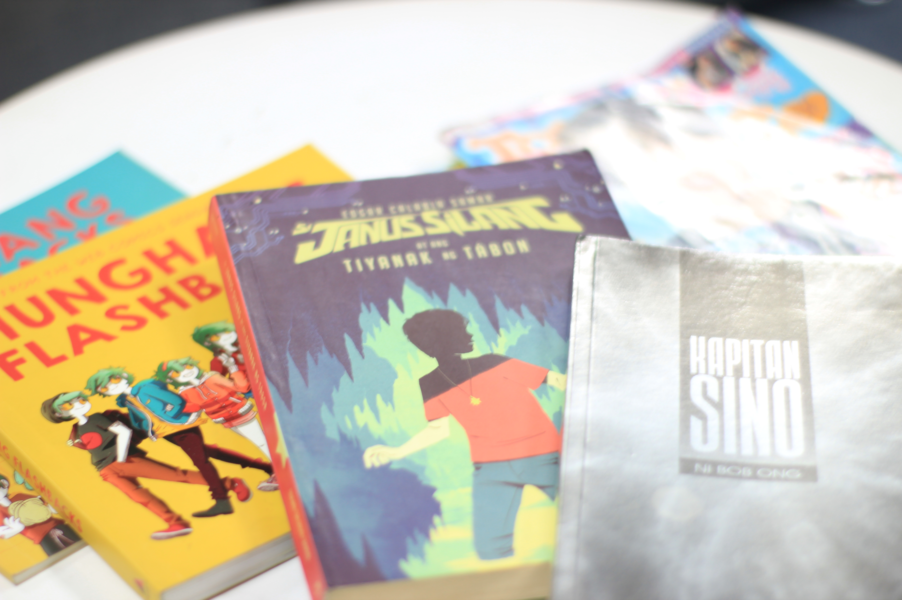

# bcrabaja.github.io
<html>
<head>
<title>Seening | Main Page</title>

<header>

</img>
 A look into the Filipino art scene

</header>
</head>

<body>

<h1>This is my article's headline</h1>

Written by Berns Rabaja Insert publishing date here

</img>

Text text filler text. Text? Text text filler paragraph. My gahd I'm so stressed. Text text filler text. Text? Text text filler paragraph. My gahd I'm so stressed. Text text filler text. 

Text text filler text. Text? Text text filler paragraph. My gahd I'm so stressed. Text text filler text. Text? Text text filler paragraph. My gahd I'm so stressed.Text text filler text. Text? Text text filler paragraph. My gahd I'm so stressed.Text text filler text. Text? Text text filler paragraph. My gahd I'm so stressed.

Text text filler text. Text? Text text filler paragraph. My gahd I'm so stressed.Text text filler text. Text? Text text filler paragraph. My gahd I'm so stressed.Text text filler text. Text? Text text filler paragraph. My gahd I'm so stressed.Text text filler text. Text? Text text filler paragraph. My gahd I'm so stressed.Text text filler text. Text? Text text filler paragraph. My gahd I'm so stressed.

Text text filler text. Text? Text text filler paragraph. My gahd I'm so stressed.Text text filler text. Text? Text text filler paragraph. My gahd I'm so stressed.

Background Photo by Lucas Lenzi on Unsplash

</body>
</html>
